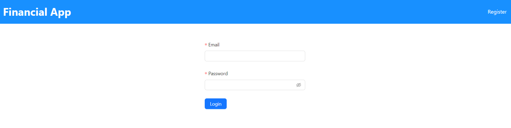
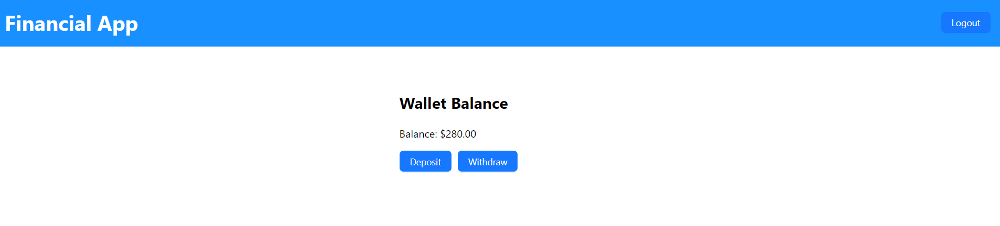
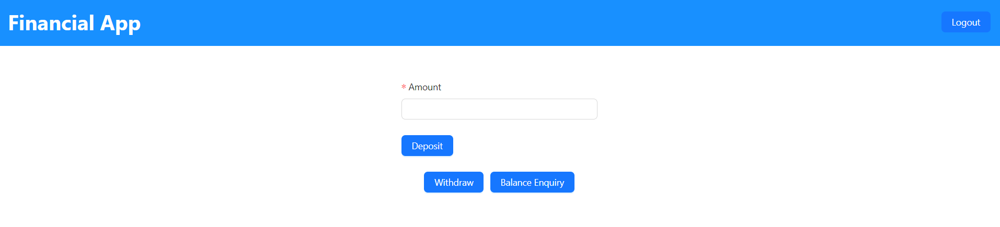
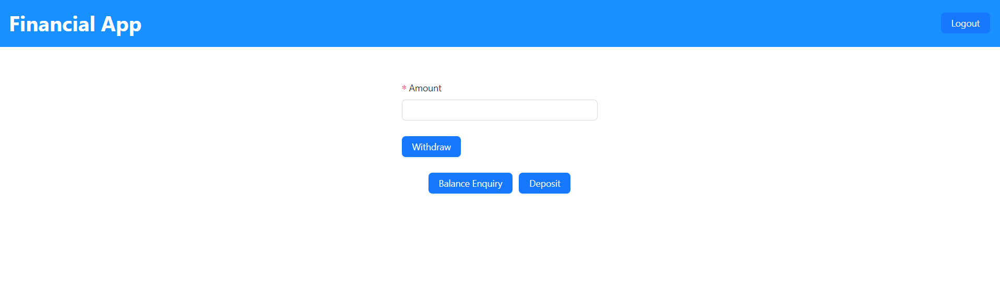

Wallet Transaction System

1. Here we have two folders app and api.
2. app folder contain frontend side using react and api folder contains the backend using django.

BACKEND INSTALLATION GUIDE
1. Move to the api folder. 
2. Create an environment(Optional) - python -m venv env
3. Activate the environment if created (.\env\Scripts\activate - Windows, source env/bin/activate - Linux)
4. Install the dependencies - pip install -r requirements.txt
5. Start the application - python manage.py runserver

FRONTEND INSTALLATION GUIDE
1. Move to app folder.
2. Install the dependencies. - yarn install
3. Start the application - yarn start

Click on the register button if account is not yet created. Else you can login using email and password.

After login balance enquiry page will be displayed. To deposit amount, click on the Deposit button. To withdraw amount, click on the Withdraw button. Following pages will be shown based on the choice(deposit or withdraw), pages will be displayed and amount can be entered and do the operation.

